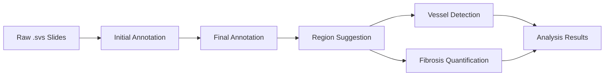

# Pipeline Overview

AutoSlide's end-to-end workflow transforms raw histological slides into actionable insights through five main stages.

## Pipeline Stages

### 1. Initial Annotation

Intelligent thresholding and region identification to detect tissue areas in whole slide images.

**Key Features:**

- Automated tissue detection using adaptive thresholding
- Morphological operations for noise reduction
- Region boundary extraction
- Preliminary tissue classification

[Learn more →](initial-annotation.md)

### 2. Final Annotation

Precise tissue labeling and mask generation for detailed analysis.

**Key Features:**

- Refined tissue segmentation
- Multi-class tissue labeling
- High-quality binary mask generation
- Integration with manual annotations from Labelbox

[Learn more →](final-annotation.md)

### 3. Region Suggestion

Strategic selection of analysis-ready sections from annotated slides.

**Key Features:**

- Context-aware region extraction
- Tissue density analysis
- Optimal section selection
- SHA-256 based unique section tracking

[Learn more →](region-suggestion.md)

### 4. Vessel Detection

Deep learning-based identification of vascular structures using pre-trained Mask R-CNN.

**Key Features:**

- Pre-trained Mask R-CNN model
- Instance segmentation of blood vessels
- Confidence-based filtering
- Visualization of detection results

[Learn more →](vessel-detection.md)

### 5. Fibrosis Quantification

Automated measurement of fibrotic tissue using HSV color analysis.

**Key Features:**

- HSV color space analysis
- Percentage-based quantification
- Customizable hue parameters
- Visual overlay generation

[Learn more →](fibrosis-quantification.md)

## Data Flow



## Running the Pipeline

### Complete Pipeline

```bash
python src/pipeline/run_pipeline.py
```

### Skip Annotation

```bash
python src/pipeline/run_pipeline.py --skip_annotation
```

### Individual Stages

Run specific stages independently for debugging or custom workflows:

```bash
# Initial annotation only
python src/pipeline/annotation/initial_annotation.py

# Final annotation only
python src/pipeline/annotation/final_annotation.py

# Region suggestion
python src/pipeline/suggest_regions.py

# Vessel detection
python src/pipeline/model/prediction.py

# Fibrosis quantification
python src/fibrosis_calculation/calc_fibrosis.py
```

## Output Structure

```
output/
├── initial_annotation/
│   ├── slide_001_annotated.png
│   └── slide_001_masks.png
├── final_annotation/
│   ├── slide_001_final.png
│   └── slide_001_labels.json
├── regions/
│   ├── slide_001_region_001.png
│   ├── slide_001_region_002.png
│   └── region_tracking.json
├── predictions/
│   ├── slide_001_region_001_pred.png
│   └── predictions.json
└── fibrosis/
    ├── slide_001_fibrosis.png
    └── fibrosis_results.csv
```

## Quality Control

Use the [Mask Validation GUI](../tools/mask-validation-gui.md) to review and validate pipeline outputs before downstream analysis.

## Next Steps

- [Initial Annotation Details](initial-annotation.md)
- [Final Annotation Details](final-annotation.md)
- [Region Suggestion Details](region-suggestion.md)
- [Vessel Detection Details](vessel-detection.md)
- [Fibrosis Quantification Details](fibrosis-quantification.md)
